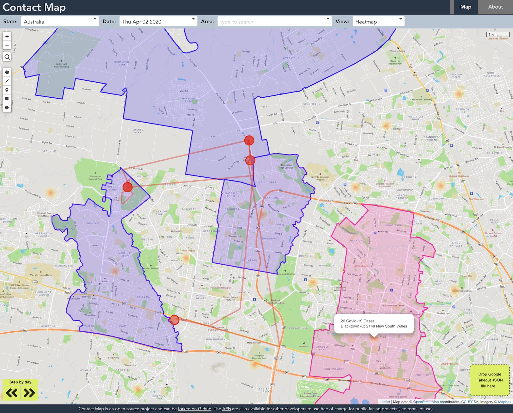

# Contact Map

## About

Contact Map allows users to anonymously upload their Google Takeout Semantic Location History json files, then display the data on the map, correlated to the times and locations for which COVID-19 data is available. A "step-through" feature allows the user to see the data change over time and how their locations appear in relation to those changes.

Using Contact Map you can see how many cases had been recorded in the places you've been, at the time you were there. If you don't have Google location data, you can still use Contact Map to review changes to COVID-19 statistics by location over time.

Live site: https://contactmap.me/

This project is built using AWS Amplify. To run this application locally you will need to clone this repo and configure your local environment as per the guide here https://docs.amplify.aws/start/q/integration/vue



As part of this work an Open API for COVID-19 data for Australia was developed. It provides a standard way to get data by date with the best precision that has been made available by the various authorities. There are also APIs for getting location information, eg bounding boxes and polygons of the areas to which the data relates.

## Project setup

```
yarn install
```

### Compiles and hot-reloads for development

```
yarn serve
```

or

```
amplify serve
```

### Compiles and minifies for production

```
yarn build
```

### Lints and fixes files

```
yarn lint
```

## Contributing

You are welcome to contribute to this project. In particular, supporting additional location data formats would be nice.
